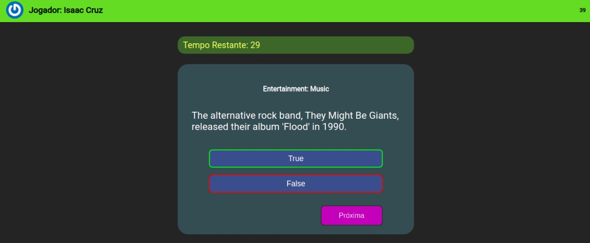
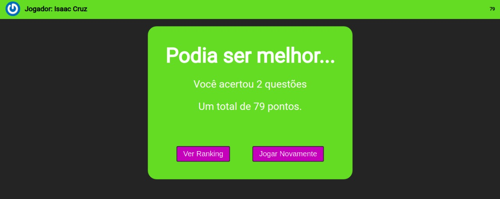
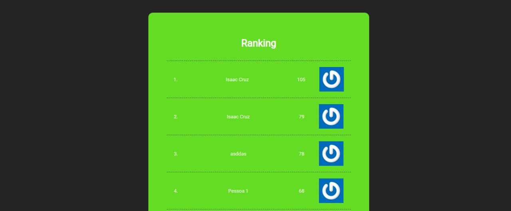

<h1 align="center">
  Projeto Trivia Game
</h1>

  <a href="#-tecnologias">Tecnologias</a>&nbsp;&nbsp;&nbsp;|&nbsp;&nbsp;&nbsp;
  <a href="#-projeto">Projeto</a>&nbsp;&nbsp;&nbsp;|&nbsp;&nbsp;&nbsp;
  <a href="#-deploy">Deploy</a>

 

 

  
  
  

## 🚀 Tecnologias

Esse projeto foi desenvolvido com as seguintes tecnologias:

- HTML
- CSS
- React
- Redux

## 💻 Projeto

O projeto Trivia Game, consiste em um jogo de perguntas e respostas, provenientes de requisições a API do Trivia, utilizando-se React e Redux para gerenciamento do estado global, além de utilizar a API do Gravatar, para demosntração do iconê dos participantes.

Este projeto foi realizado em grupo, pelos seguintes integrantes:
- Isaac Cruz;
- Leonardo Ferreira ([GitHub](https://github.com/leo606));
- Lucas Chamma Nahas ([GitHub](https://github.com/LucasChammaNahas));
- Victor Emmanuel ([GitHub](https://github.com/Victoresta21));

## 🔖 Deploy

Você pode visualizar a aplicação do projeto através [desse link](https://isaaccruzlm.github.io/TriviaGame/).

---

By Isaac Cruz Leite Machado :wave:.

